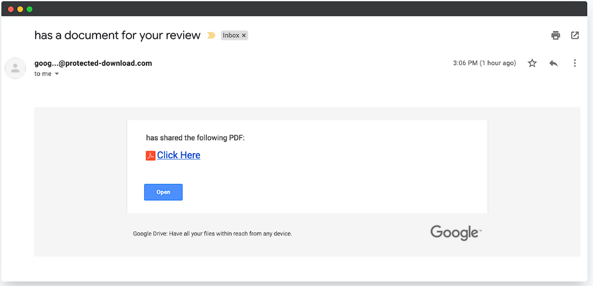

# Cyber_Internship_task2
# Task 2: Phishing-Email Analysis

## Objective  
Identify phishing characteristics in four suspicious email samples to strengthen awareness of common tactics and indicators.

## Samples Reviewed  
| ID | Snapshot | Claimed Brand | Apparent Sender | Key Message |
|----|-----------|---------------|-----------------|-------------|
| 1  |  | Google Drive | `goog…@protected-download.com` | “has shared the following PDF – Click Here” |
| 2  |  | GitHub | `GitHub@bigdogdomains.co` | “Verify your email address” |
| 3  |  | Microsoft | `support@msupdate.net` | “Your password changed” |
| 4  |  | Office 365 | `microsoft@email-records.com` | “High-severity alert – View alert details” |

## Phishing Indicators Found

| Indicator Category | Email 1 | Email 2 | Email 3 | Email 4 |
|--------------------|:-------:|:-------:|:-------:|:-------:|
| **Spoofed / look-alike sender domain** | protected-download.com (not google.com)[1] | bigdogdomains.co (not github.com)[2] | msupdate.net (not microsoft.com)[3] | email-records.com (not microsoft.com)[4] |
| **Generic or missing sender name** | Yes – blank display name[1] | Yes – “GitHub” but wrong domain[2] | “Support” but wrong domain[3] | “Microsoft” but wrong domain[4] |
| **Suspicious call-to-action link / button** | “Click Here” & “Open” with unknown URL[1] | “Verify email address” button[2] | Multiple reset/review links[3] | “View alert details” button[4] |
| **Urgent / alarming language** | Implied urgency to review a document[1] | “Almost done… verify now”[2] | “Your account has been compromised”[3] | “High-severity alert has been triggered”[4] |
| **Branding inconsistencies / poor design** | Minimal content, no name or logo[1] | Top banner added separately, odd spacing[2] | Basic text, no official footer[3] | Inconsistent fonts & spacing[4] |
| **Hover-over URL mismatch** (*would reveal when tested*) | Likely | Likely | Likely | Likely |
| **Spelling / grammar issues** | None visible | None visible | Minor phrasing oddities | “Phish delivered…” awkward wording |

## Analysis Notes
1. **Email 1** masquerades as a Google Drive share but originates from an unrelated domain. The vague “Click Here” link and absent sender name strongly suggest phishing.
2. **Email 2** copies GitHub branding yet uses a `.co` domain unrelated to GitHub. Verification requests are a common ploy to harvest credentials.
3. **Email 3** claims a password change and pressures the user to “reset” credentials. The domain `msupdate.net` is not owned by Microsoft.
4. **Email 4** fabricates a security alert to create panic. The sender domain, generic footer, and urge to “View alert details” all point to a phishing lure.

## Recommended Header Checks (next step)  
If raw headers were available, paste them into tools such as Google’s Message Header Analyzer or MXToolbox to confirm:
- Return-Path and SPF/DKIM failures.  
- Sender IP geolocation inconsistent with the brand.  
- Received-from chains indicating relay through suspicious servers.

## Conclusion  
All four samples exhibit multiple red-flag indicators—spoofed domains, urgent language, and suspicious links—confirming they are phishing attempts. Users should avoid clicking any links, report these messages to security teams, and verify sender legitimacy via trusted channels.

---

**Repository Contents**
- `phishing_analysis.md` ← this report  
- `/screenshots/` ← the four email images  
